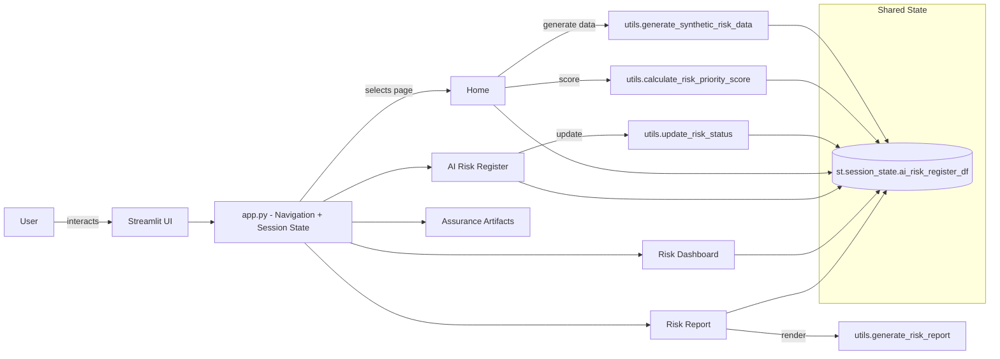

id: 6931cf92ca38c557e5169645_documentation
summary: Lab 1: Principles of AI Risk and Assurance - Clone Documentation
feedback link: https://docs.google.com/forms/d/e/1FAIpQLSfWkOK-in_bMMoHSZfcIvAeO58PAH9wrDqcxnJABHaxiDqhSA/viewform?usp=sf_link
environments: Web
status: Published
# QuLab: AI Risk & Assurance Lab — Developer Codelab

## 1. Why this app matters: Context, concepts, and value
Duration: 05:00

This codelab walks developers through the QuLab: AI Risk & Assurance Lab — a Streamlit application that demonstrates an end-to-end AI risk management workflow aligned to NIST AI RMF and SR 11-7. You’ll learn how to generate a synthetic AI risk register, score and prioritize risks, visualize the risk landscape, manage status updates, and produce comprehensive reports — all while understanding how the app is architected and how state flows between pages.

What you’ll take away:
- Practical understanding of AI risk management workflows in regulated environments.
- How to implement an AI risk taxonomy across Data, Model, System, Human, and Organizational dimensions.
- How to convert qualitative likelihood/impact ratings into quantitative scores for prioritization.
- How to map risks to NIST AI RMF functions and SR 11-7 pillars for governance and compliance narratives.
- How to build multi-page Streamlit apps with shared state and structured utilities.

Key concepts covered:
- AI Risk Register: a structured table of risks and controls.
- Scoring: compute Risk_Priority_Score using a simple matrix.
- Visualization: dashboards for categories, heatmaps, and framework mappings.
- Assurance artifacts: conceptual Model Cards and Data Cards.
- Reporting: generating an executive-ready, markdown-based risk report.

<aside class="positive">
This codelab is ideal for developers building responsible AI tooling and internal control dashboards. It shows how to combine governance concepts with a pragmatic engineering approach.
</aside>


## 2. Prerequisites and setup
Duration: 04:00

- Python 3.9+ recommended
- Basic familiarity with Streamlit, pandas, and Plotly

Install dependencies:
```bash
python -m venv .venv
source .venv/bin/activate  # Windows: .venv\Scripts\activate
pip install streamlit pandas numpy faker plotly seaborn matplotlib
```

Project layout (as used in this codelab):
```console
.
├─ app.py
├─ utils.py
└─ application_pages/
   ├─ page_1_home.py
   ├─ page_2_risk_register.py
   ├─ page_3_risk_dashboard.py
   ├─ page_4_assurance_artifacts.py
   └─ page_5_risk_report.py
```

Run the app:
```bash
streamlit run app.py
```

<aside class="negative">
If you change imports or rename modules, ensure Streamlit’s autoreload detects them. Otherwise, stop and re-run <b>streamlit run app.py</b>.
</aside>


## 3. High-level architecture and data flow
Duration: 05:00

The application is a multi-page Streamlit app using a shared stateful DataFrame (AI Risk Register) stored in st.session_state. Pages import utility functions from utils.py to generate, score, update, and report on risks.

Architecture diagram:


Data lifecycle:
- Creation: Home page generates synthetic risks via utils.generate_synthetic_risk_data.
- Scoring: Risk_Priority_Score computed via utils.calculate_risk_priority_score.
- CRUD/Updates: AI Risk Register page adds/edits risks and updates status via utils.update_risk_status.
- Visualization: Dashboard reads from session_state and renders Plotly charts.
- Reporting: Risk Report generates a markdown summary via utils.generate_risk_report.


## 4. Data model and shared state
Duration: 03:00

The shared register is a pandas DataFrame stored in st.session_state.ai_risk_register_df with columns:
- Risk_ID, Risk_Description, Risk_Category, Likelihood, Impact
- Mitigation_Controls, Response_Plan
- NIST_AI_RMF_Function, SR_11_7_Pillar
- Responsible_Party, Status, Risk_Priority_Score

Initialization (app.py):
```python
if 'ai_risk_register_df' not in st.session_state:
    st.session_state.ai_risk_register_df = pd.DataFrame(columns=[
        "Risk_ID", "Risk_Description", "Risk_Category", "Likelihood", "Impact",
        "Mitigation_Controls", "Response_Plan", "NIST_AI_RMF_Function",
        "SR_11_7_Pillar", "Responsible_Party", "Status", "Risk_Priority_Score"
    ])
```

Best practices:
- Always read/write via st.session_state to persist across pages.
- Recompute Risk_Priority_Score on add/edit to keep scores in sync.


## 5. Home: Generate synthetic risks and compute scores
Duration: 07:00

Open the “Home” page. You can generate a synthetic risk register for exploration and demos.

Key utilities (utils.py):
```python
def generate_synthetic_risk_data(num_risks: int) -> pd.DataFrame: ...
def calculate_risk_priority_score(df_register: pd.DataFrame) -> pd.Series: ...
```

Scoring formula:
- Map Likelihood and Impact from {Low, Medium, High} to {1, 2, 3}.
- Priority score S is the product:
$$
S = \text{Likelihood}_{\text{numeric}} \times \text{Impact}_{\text{numeric}}
$$

Heatmap intuition (score matrix):
$$
\begin{pmatrix}
\textbf{Likelihood} / \textbf{Impact} & \textbf{Low (1)} & \textbf{Medium (2)} & \textbf{High (3)} \\
\textbf{Low (1)} & 1 & 2 & 3 \\
\textbf{Medium (2)} & 2 & 4 & 6 \\
\textbf{High (3)} & 3 & 6 & 9
\end{pmatrix}
$$

Try it:
- Choose “Number of synthetic risks to generate” (e.g., 30).
- Click “Generate Synthetic Data.”
- Inspect the resulting DataFrame and confirm Risk_Priority_Score exists.

Programmatic example (for reference):
```python
from utils import generate_synthetic_risk_data, calculate_risk_priority_score

df = generate_synthetic_risk_data(10)
df["Risk_Priority_Score"] = calculate_risk_priority_score(df)
print(df.head())
```


## 6. AI Risk Register: Add, edit, and update status
Duration: 08:00

The “AI Risk Register” page is your CRUD interface to manage entries.

- Add New Risk:
  - Captures description, category, likelihood, impact, controls, response plan, framework mappings, responsible party, and status.
  - Auto assigns Risk_ID.
  - Auto calculates Risk_Priority_Score.

- Edit Existing Risk:
  - Select by Risk_ID, edit fields, and save.
  - Risk_Priority_Score is recomputed if Likelihood/Impact changed.

- Update Risk Status:
  - Select a risk and mark it Identified, In Progress, Mitigated, or Monitored.

Status updates use:
```python
def update_risk_status(df_register, risk_id, new_status) -> pd.DataFrame
```

Edit example snippet:
```python
# Recalculate Risk_Priority_Score for a specific row after edit
idx = df[df["Risk_ID"] == selected_id].index[0]
df.loc[idx, "Risk_Priority_Score"] = calculate_risk_priority_score(df.loc[[idx]])
```

<aside class="positive">
Use the register as a single source of truth. Encourage frequent updates to keep dashboards and reports aligned with reality.
</aside>

<aside class="negative">
update_risk_status validates status values. Invalid entries trigger <b>st.error</b> and no changes are applied.
</aside>


## 7. Risk Dashboard: Visual insights and interaction
Duration: 07:00

The “Risk Dashboard” visualizes the state of your register using Plotly:

- Risks by Category: Bar chart showing distribution across Data, Model, System, Human, Organizational.
- Likelihood vs. Impact: Heatmap via pd.crosstab for fast risk profile scanning.
- Status Overview: Pie chart to track mitigation progress.
- Mappings to NIST AI RMF and SR 11-7: Grouped histograms by risk category to show alignment with governance frameworks.

Interactive status update:
- The dashboard also includes a demonstration control to update a risk’s status and rerun the page to refresh visuals.

Sample visualization code (page_3_risk_dashboard.py):
```python
fig_category = px.bar(
    df["Risk_Category"].value_counts().reset_index(),
    x="index", y="Risk_Category", title="Distribution of Risks by Category",
    labels={"index": "Risk Category", "Risk_Category": "Number of Risks"},
)
st.plotly_chart(fig_category, use_container_width=True)
```

<aside class="positive">
Dashboards help prioritize mitigation by quickly surfacing concentrations of risk (e.g., many “High Impact” risks in one category).
</aside>


## 8. Assurance artifacts: Model Cards and Data Cards
Duration: 04:00

The “Assurance Artifacts” page provides structured templates and guidance for:
- Model Cards: Model details, intended use, performance, fairness, ethical considerations, and usage guidelines.
- Data Cards: Dataset overview, collection and processing, characteristics and biases, provenance, and maintenance.

These artifacts:
- Improve transparency and accountability.
- Support “effective challenge” and regulatory expectations.
- Tie directly into the Data and Model risk categories and the NIST AI RMF Map and Measure functions.

Developer tip:
- Consider backing these forms with structured JSON/YAML and a document generator for PDF export, then reference these artifacts from risks in the register.


## 9. Risk Report: Generate a comprehensive markdown summary
Duration: 05:00

The “Risk Report” page produces a markdown document consolidating:
- Counts by category
- Priority score distribution
- Status overview
- Top 5 high-priority risks
- First 10 entries of the full register
- NIST AI RMF function distribution
- SR 11-7 pillar distribution

Utility function (utils.py):
```python
def generate_risk_report(df_register: pd.DataFrame) -> str:
    # returns a markdown-formatted report string
```

Try it:
- Ensure you have a non-empty AI Risk Register (from Home or AI Risk Register pages).
- Click “Generate Comprehensive Risk Report.”
- Copy/Save the rendered text for sharing with stakeholders.


## 10. Code tour: Key modules
Duration: 06:00

- app.py
  - Sets page config and initializes st.session_state.ai_risk_register_df.
  - Provides sidebar navigation to pages.
- utils.py
  - generate_synthetic_risk_data: Creates realistic synthetic entries with Faker.
  - calculate_risk_priority_score: Converts qualitative values to a matrix score.
  - update_risk_status: Validates and updates status with success/error messaging.
  - generate_risk_report: Aggregates, summarizes, and outputs markdown.
- application_pages/
  - page_1_home.py: Core concepts, data generation, scoring overview.
  - page_2_risk_register.py: CRUD and status updates with forms.
  - page_3_risk_dashboard.py: Visual analytics with Plotly.
  - page_4_assurance_artifacts.py: Model and Data Card templates (conceptual).
  - page_5_risk_report.py: One-click report generation.


## 11. Extending the application
Duration: 06:00

Ideas:
- Persistence: Store the register in SQLite or a cloud DB to share across sessions.
- Authentication: Add access control for edit/report pages.
- Audit trails: Log changes to risks (who/what/when).
- Advanced scoring: Replace the simple matrix with weighted scoring or expected loss:
  - Example: $S = \alpha \cdot \text{Likelihood} + \beta \cdot \text{Impact} + \gamma \cdot \text{Detectability}$
- Alerts: Send notifications when high-priority risks are added or change status.
- Export: Add buttons to export the register to CSV/Parquet, and the report to PDF.

Sample: persistence stub
```python
# Example: Save and load from CSV (simple persistence)
st.session_state.ai_risk_register_df.to_csv("ai_risk_register.csv", index=False)
df = pd.read_csv("ai_risk_register.csv")
```

<aside class="positive">
Start with CSV for quick wins; graduate to SQLite or Postgres for collaboration and concurrency.
</aside>


## 12. Troubleshooting and FAQs
Duration: 03:00

- The dashboard is empty.
  - Ensure you generated data (Home) or added risks (AI Risk Register).
- Scores missing after edits.
  - Confirm calculate_risk_priority_score is called on updates to Likelihood/Impact.
- Invalid status errors.
  - update_risk_status enforces values: Identified, In Progress, Mitigated, Monitored.
- Streamlit state not updating.
  - After updates, call st.rerun() to refresh UI elements based on new data.

Common code snippet to recompute score after edit:
```python
df.loc[idx, "Risk_Priority_Score"] = calculate_risk_priority_score(df.loc[[idx]])
```


## 13. Summary and next steps
Duration: 02:00

You built and understood a complete AI risk management workflow:
- Generated a synthetic AI risk register and computed a priority score.
- Managed register entries and updated statuses over time.
- Visualized risk distributions, heatmaps, and framework mappings.
- Captured documentation needs via Model and Data Cards.
- Generated an executive-ready risk report.

Next, adapt the scoring model, add persistence and audit logs, and link real model monitoring metrics to drive risk updates automatically.

<button>
  [Download Sample Code (zip)](https://example.com/qulab-ai-risk-assurance.zip)
</button>

