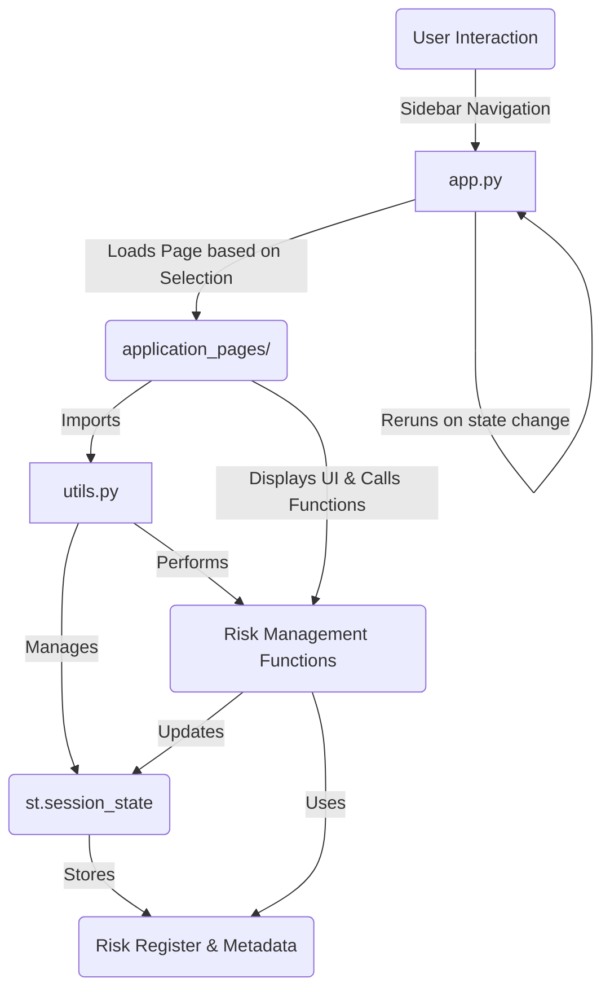

id: 6931cf92ca38c557e5169645_documentation
summary: AI Design and Deployment Lab 1 - Clone Documentation
feedback link: https://docs.google.com/forms/d/e/1FAIpQLSfWkOK-in_bMMoHSZfcIvAeO58PAH9wrDqcxnJABHaxiDqhSA/viewform?usp=sf_link
environments: Web
status: Published
# AI Model Risk Management with Streamlit: A Comprehensive Guide

## 1. Introduction to AI Model Risk Management & Application Overview
Duration: 0:05

Welcome to this codelab, where you will embark on a critical journey as a Quantitative Analyst at QuantBank. Your mission is to perform a formal risk assessment of a new AI-powered Credit Risk Scoring Model. This model is not just a theoretical construct; it's poised to automate crucial loan approval decisions, making its integrity, fairness, and compliance with stringent financial regulations (like SR 11-7) paramount.

This application provides a structured, interactive environment to guide you through the complete AI Model Risk Management lifecycle, from understanding the model and its data to identifying, assessing, mitigating, and reporting AI risks. By the end of this codelab, you will have a comprehensive understanding of how to manage AI risks in a regulated financial context using a practical Streamlit application.

The core principle guiding this assessment, and indeed all risk management, is that risk is a function of potential impact and likelihood. In quantitative terms, this can be expressed as:

$$ Risk = Impact \times Likelihood $$

Where *Impact* refers to the severity of adverse outcomes (e.g., financial loss, reputational damage, regulatory penalties), and *Likelihood* refers to the probability of the adverse event occurring. This fundamental equation will underpin your entire workflow.

### Application Flow and Architecture

The Streamlit application is designed with a clear, sequential flow, mimicking a real-world risk assessment process. It's structured into multiple pages, each focusing on a specific aspect of AI risk management.

The application's architecture is modular, promoting reusability and maintainability:

1.  **`app.py`**: The main entry point, responsible for setting up the Streamlit page configuration, displaying the sidebar navigation, and routing to different `application_pages` based on user selection.
2.  **`utils.py`**: A central utility file that handles:
    *   Session state initialization for persistent data (e.g., risk register, model/data cards) across page navigations.
    *   Helper functions for navigation (`go_to_page`).
    *   Core risk management logic (adding risks, assessing severity, plotting, adding mitigations, generating reports).
    *   Initialization of metadata for the hypothetical AI model and dataset.
3.  **`application_pages/`**: A directory containing individual Python files, each representing a distinct page in the Streamlit application. This structure keeps the UI and logic for each step organized.

Below is a high-level architecture diagram illustrating the interaction between these components:


<br>

<aside class="positive">
This codelab will walk you through each page and its underlying functionalities, demonstrating how Streamlit can be used to build powerful, interactive, and transparent tools for AI governance and risk management.
</aside>

## 2. Setting Up the Environment and Running the Application
Duration: 0:03

To run this Streamlit application, you'll need Python installed on your system along with a few libraries.

### Prerequisites

*   Python 3.8+
*   `pip` (Python package installer)

### Installation Steps

1.  **Clone the Repository (or create the files):**
    If you have the files locally, ensure they are organized as described in the architecture. Otherwise, you'd typically clone a Git repository. For this exercise, assume you have the `app.py`, `utils.py`, and `application_pages/` directory in your working directory.

2.  **Install Dependencies:**
    Open your terminal or command prompt, navigate to the directory where your `app.py` is located, and install the required Python packages:

    ```console
    pip install streamlit pandas matplotlib seaborn
    ```

### Running the Application

Once the dependencies are installed, you can launch the Streamlit application:

```console
streamlit run app.py
```

This command will open a new tab in your web browser, displaying the Streamlit application.

<aside class="positive">
Familiarize yourself with the Streamlit interface. The left sidebar is your primary navigation tool, allowing you to move through the different stages of the AI risk assessment.
</aside>

### Initializing Session State (`utils.py`)

A crucial aspect of Streamlit applications, especially multi-page ones, is managing state. Streamlit's `st.session_state` allows you to persist data across reruns and page changes. The `utils.py` file plays a vital role in initializing these session state variables.

```python
# utils.py
import pandas as pd
import streamlit as st
import matplotlib.pyplot as plt
import seaborn as sns

# Initialize session state variables if they don't exist
if 'current_sidebar_page_index' not in st.session_state:
    st.session_state.current_sidebar_page_index = 0 # Corresponds to the index in the sidebar selectbox
if 'risk_register_df' not in st.session_state:
    st.session_state.risk_register_df = pd.DataFrame(columns=[
        "Risk ID", "Dimension", "Category", "Description", 
        "Potential Impact", "Likelihood", "Risk Score", 
        "Mitigation Strategy", "Responsible Party", "Status"
    ])
if 'next_risk_id' not in st.session_state:
    st.session_state.next_risk_id = 1

# ... (other initializations for model and data cards) ...
```
This code snippet ensures that when the application first starts, or if a user clears their session, essential variables like the `risk_register_df` (a Pandas DataFrame to store all identified risks) and `next_risk_id` are set up correctly. This prevents errors and ensures a smooth user experience.

## 3. Understanding the AI Model (Pages 1 & 2)
Duration: 0:08

The first two pages of the application (`application_pages/page_1_welcome.py` and `application_pages/page_2_model_overview.py`) lay the groundwork for your risk assessment by introducing the scenario and providing a comprehensive overview of the AI model.

### 3.1. Welcome & Scenario Setup (`page_1_welcome.py`)

This page sets the strategic context for the entire codelab.

```python
# application_pages/page_1_welcome.py
import streamlit as st
from utils import go_to_page

def main():
    st.title("AI Model Risk Assessment: Credit Risk Scoring Model")
    st.markdown(r"""
    # 1. Setting the Scene: The Critical Role of an AI Risk Manager
    # ... (content omitted for brevity) ...
    The core principle guiding this assessment is the understanding that risk is a function of potential impact and likelihood. In quantitative terms, this can be expressed as:

    $$ Risk = Impact \times Likelihood $$
    # ... (content omitted for brevity) ...
    """)

    st.markdown("As a Quant Analyst at QuantBank, this first step sets the stage for a crucial task: ensuring the new AI Credit Risk Model is safe and compliant. Understanding the core concept that risk is a product of impact and likelihood is fundamental to your role, as it guides all subsequent assessments and prioritizations. This narrative introduces the stakes involved and the basic formula that will underpin your entire workflow.")

    if st.button("Start Assessment", key="start_assessment_btn"):
        go_to_page(1) # Navigate to the next page (index 1 for "Model Overview & Card")
```
This `main` function simply displays the introductory text and the fundamental risk equation. The "Start Assessment" button uses `go_to_page(1)` from `utils.py` to navigate to the next page.

### 3.2. Model Overview & Card (`page_2_model_overview.py`)

This page provides the initial details about the AI Credit Risk Scoring Model and introduces the concept of an AI Model Card.

```python
# application_pages/page_2_model_overview.py
import streamlit as st
from utils import go_to_page

def main():
    st.header("2. Understanding the Credit Risk AI Model")
    st.markdown("As a Quantitative Analyst, before diving into risk identification, you need to thoroughly understand the AI model itself. This involves grasping its fundamental purpose, the algorithm it uses, and its intended operational environment. For the new Credit Risk Scoring Model, you've gathered initial details from the development team. This foundational understanding is the first step in applying frameworks like SR 11-7 and NIST AI RMF, ensuring you assess the right 'model' in its specific context.")
    st.subheader("Hypothetical AI Model Scenario Details:")
    for key, value in st.session_state.credit_risk_model_scenario.items():
        st.markdown(f"- **{key}**: {value}")

    st.markdown("""
    # ... (content omitted for brevity) ...
    """)

    st.header("3. Constructing the AI Model Card: Transparency & Key Facts")
    st.markdown("""
    To ensure transparency and facilitate effective challenge, you need to create an 'AI Model Card' for the Credit Risk Scoring Model. This artifact, inspired by best practices in AI assurance, summarizes crucial information about the model, including its purpose, performance metrics, and known limitations. This proactive documentation is vital for internal stakeholders and external auditors, enhancing accountability and reducing information asymmetry, directly supporting SR 11-7's emphasis on validation and governance.
    """)
    st.subheader("AI Model Card: Credit Risk Scoring Model")
    
    # Display model card with appropriate formatting
    model_card_display = st.session_state.credit_risk_model_card.copy()
    model_card_display["Key Performance Metrics"] = {
        "AUC": f"{st.session_state.hypothetical_auc:.2f}",
        "Precision@90%Recall": f"{st.session_state.hypothetical_precision_at_recall:.2f}",
        "Target Variable": "Defaulted (Binary: 1 for default, 0 for no default)"
    }
    st.json(model_card_display)

    st.markdown(r"""
    The generated Model Card provides a structured summary. As a Risk Manager, you immediately see the model's purpose, algorithm, and crucial performance indicators (AUC: $0.85$, Precision@90%Recall: $0.60$). Importantly, the "Known Limitations" section proactively highlights areas of concern like potential bias and performance degradation, which will be central to your risk identification process. This artifact serves as a single source of truth for the model's core information.
    """)
    # ... (navigation buttons omitted for brevity) ...
```

The `utils.py` file initializes the `credit_risk_model_scenario` and `credit_risk_model_card` in `st.session_state`:

```python
# utils.py - Model Card Initialization Snippet
# ... (session state initializations) ...

if 'credit_risk_model_scenario' not in st.session_state:
    def initialize_model_scenario_metadata():
        model_metadata = {
            "Name": "Credit Risk Scoring Model v1.0",
            "Type": "Supervised Learning, Classification",
            "Algorithm": "Gradient Boosting Classifier (e.g., LightGBM)",
            "Purpose": "To predict the likelihood of loan default for retail loan applicants.",
            "Intended_Use": "Automate approval for low-risk applicants and flag high-risk applicants for manual underwriting review.",
            "Key_Inputs": ["Age", "Income", "LoanAmount", "CreditScore", "EmploymentStatus", "ResidentialStatus"],
            "Output": "Probability of Default (0-1), Binary Decision (Approve/Reject)",
            "Development_Team": "QuantBank Data Science Department",
            "Deployment_Environment": "API integrated into legacy Loan Origination System",
            "Regulatory_Context": "SR 11-7, potential for future AI-specific regulations"
        }
        return model_metadata
    st.session_state.credit_risk_model_scenario = initialize_model_scenario_metadata()

if 'hypothetical_auc' not in st.session_state:
    st.session_state.hypothetical_auc = 0.85
if 'hypothetical_precision_at_recall' not in st.session_state:
    st.session_state.hypothetical_precision_at_recall = 0.60

if 'credit_risk_model_card' not in st.session_state:
    model_card_template = {
        "Model Name": None, "Version": None, "Purpose": None, "Intended Use": None,
        "Algorithm": None, "Key Performance Metrics": {}, "Known Limitations": [],
        "Developer": None, "Last Review Date": None
    }
    def populate_model_card(model_metadata, auc_score, precision_at_recall_90):
        model_card = model_card_template.copy()
        model_card["Model Name"] = model_metadata["Name"]
        model_card["Version"] = "1.0"
        model_card["Purpose"] = model_metadata["Purpose"]
        model_card["Intended Use"] = model_metadata["Intended_Use"]
        model_card["Algorithm"] = model_metadata["Algorithm"]
        model_card["Key Performance Metrics"] = {
            "AUC": auc_score,
            "Precision@90%Recall": precision_at_recall_90,
            "Target Variable": "Defaulted (Binary: 1 for default, 0 for no default)"
        }
        model_card["Known Limitations"] = [
            "Potential for disparate impact on certain demographic groups due to historical data biases.",
            "Performance may degrade with significant shifts in economic conditions not present in training data.",
            "Limited interpretability for individual predictions (black-box nature of Gradient Boosting)."
        ]
        model_card["Developer"] = model_metadata["Development_Team"]
        model_card["Last Review Date"] = "2024-03-15"
        return model_card
    st.session_state.credit_risk_model_card = populate_model_card(
        st.session_state.credit_risk_model_scenario,
        st.session_state.hypothetical_auc,
        st.session_state.hypothetical_precision_at_recall
    )
```
As a developer, understanding this page is crucial because it demonstrates:
*   How to present foundational model information in a clear, structured way.
*   The concept of an AI Model Card as a transparency artifact.
*   How `st.session_state` is used to store and display model metadata.
*   The use of `st.json()` to display dictionary-like structures in a readable format.

## 4. Examining the Training Data (Page 3)
Duration: 0:07

The quality and characteristics of the training data are paramount to an AI model's performance and fairness. `application_pages/page_3_data_overview.py` focuses on documenting the synthetic dataset used for the Credit Risk Scoring Model, highlighting its provenance, features, and crucial potential biases or quality issues.

```python
# application_pages/page_3_data_overview.py
import streamlit as st
from utils import go_to_page

def main():
    st.header("3. Dissecting the Data for the Credit Risk Model")
    st.markdown("The quality and characteristics of the training data are paramount to an AI model's performance and fairness. As a Quantitative Analyst, you understand that 'garbage in, garbage out' applies rigorously to AI. You need to document the synthetic dataset used to train the Credit Risk Scoring Model. This 'Data Card' will detail its provenance, features, and crucially, any identified biases or quality issues. This directly addresses the 'Data' dimension of AI risk, as highlighted by NIST AI RMF and SR 11-7's emphasis on data quality in model validation.")
    st.subheader("Data Card: Credit Application Data")
    
    # Display data card with appropriate formatting
    st.json(st.session_state.credit_data_card)

    st.markdown("""
    The Data Card clearly outlines the dataset's characteristics and, critically, highlights potential biases and data quality issues. As a Risk Manager, you note the "Historical lending bias" and "Underrepresentation" as immediate red flags for fairness, while "Missing Data" and "CreditScore Lag" point to accuracy and reliability concerns. This information directly informs the data-related risks you'll formally document in the risk register.
    """)
    # ... (navigation buttons omitted for brevity) ...
```

The `utils.py` file initializes the `synthetic_dataset_details` and `credit_data_card` in `st.session_state`:

```python
# utils.py - Data Card Initialization Snippet
# ... (previous session state initializations) ...

if 'synthetic_dataset_details' not in st.session_state:
    st.session_state.synthetic_dataset_details = {
        "dataset_name": "Credit_Application_Data",
        "source": "Internal CRM and historical loan records (synthetic generation)",
        "collection_method": "Aggregated transactional and demographic data, anonymized",
        "size": (10000, 7),
        "features_desc": {
            "Age": "Applicant's age (years)",
            "Income": "Annual income (USD)",
            "LoanAmount": "Requested loan amount (USD)",
            "CreditScore": "Credit score from a third-party bureau",
            "EmploymentStatus": "Categorical: Employed, Unemployed, Student, Retired",
            "ResidentialStatus": "Categorical: Owner, Renter, Other",
            "Defaulted": "Binary target: 1 if loan defaulted, 0 otherwise"
        },
        "sensitive_features": ["Age", "Income", "ResidentialStatus"],
        "potential_biases": [
            "Historical lending bias: Dataset shows lower approval rates for 'Renter' in specific income brackets.",
            "Underrepresentation: Limited data for applicants under 25 or over 65.",
            "Missing Data: Approximately 5% missing values in 'EmploymentStatus', imputed with mode.",
            "CreditScore Lag: CreditScore data updated quarterly, may not reflect real-time creditworthiness."
        ],
        "preprocessing_steps": [
            "Missing 'EmploymentStatus' values imputed using mode strategy.",
            "Categorical features one-hot encoded.",
            "Numerical features scaled using StandardScaler."
        ]
    }
if 'credit_data_card' not in st.session_state:
    data_card_template = {
        "Dataset Name": None, "Source": None, "Collection Method": None,
        "Size (rows, features)": None, "Features Description": {},
        "Sensitive Features": [], "Potential Biases": [],
        "Preprocessing Steps": [], "Last Update Date": None
    }
    def populate_data_card(dataset_name, source, collection_method, size, features_desc, sensitive_features, potential_biases, preprocessing_steps):
        data_card = data_card_template.copy()
        data_card["Dataset Name"] = dataset_name
        data_card["Source"] = source
        data_card["Collection Method"] = collection_method
        data_card["Size (rows, features)"] = size
        data_card["Features Description"] = features_desc
        data_card["Sensitive Features"] = sensitive_features
        data_card["Potential Biases"] = potential_biases
        data_card["Preprocessing Steps"] = preprocessing_steps
        data_card["Last Update Date"] = "2024-03-10"
        return data_card
    st.session_state.credit_data_card = populate_data_card(**st.session_state.synthetic_dataset_details)
```

By displaying the Data Card, this page emphasizes the critical role of data quality and bias detection in AI risk management. As a developer, this section highlights how to use `st.json()` to present detailed data provenance and characteristics, similar to the Model Card. The listed `potential_biases` directly feed into the risk identification phase.

## 5. Delving into AI Risk Frameworks (Page 4)
Duration: 0:07

`application_pages/page_4_ai_frameworks.py` is dedicated to explaining the theoretical underpinnings of AI risk management in a financial context. It introduces two crucial frameworks: SR 11-7 and NIST AI RMF 1.0.

```python
# application_pages/page_4_ai_frameworks.py
import streamlit as st
from utils import go_to_page

def main():
    st.header("4. Foundations: SR 11-7 & NIST AI RMF 1.0")
    st.markdown("## Foundations of Financial Model Risk: SR 11-7 in an AI Context")
    st.markdown("As a Quantitative Analyst in a financial institution, SR 11-7 (Supervisory Guidance on Model Risk Management) is your bedrock for model governance. While it predates modern AI, its core principles of Model Risk Management (MRM) remain highly relevant. You must consider how SR 11-7's pillars—model development, implementation, validation, and governance—translate to AI systems. This conceptual mapping ensures that even novel AI models are subject to the same rigor and oversight as traditional financial models, especially concerning 'effective challenge' and sound governance.")

    st.info("As a Quant Analyst, SR 11-7 is your bedrock for model governance. Remember: model risk intensifies with complexity, input uncertainty, and broader use.")
    
    st.markdown("## Embracing Trustworthy AI: The NIST AI RMF 1.0 Framework")
    st.markdown("Beyond SR 11-7's financial focus, the NIST AI Risk Management Framework (AI RMF 1.0) provides a broader, cross-sector lens for managing AI risks and promoting trustworthy AI. As an AI Risk Manager, you recognize the need to integrate these principles, which encompass attributes like validity, reliability, safety, security, transparency, fairness, accountability, and privacy-preserving. This framework complements SR 11-7 by offering a structured approach to identifying, measuring, and managing the unique risks posed by AI systems across their entire lifecycle. You will leverage its taxonomy and attributes to ensure a comprehensive risk assessment.")

    st.markdown("The NIST AI RMF categorizes trustworthiness attributes as follows:
    -   **Validity**: Ensuring the AI system accurately performs its intended function and produces correct outputs for its specified purpose.
    -   **Reliability**: Guarantees consistent and stable performance of the AI system over time and across various operational conditions.
    -   **Safety**: Minimizing the potential for the AI system to cause harm to individuals, society, or the environment.
    -   **Security**: Protecting AI systems from adversarial attacks and ensuring data integrity.
    -   **Transparency**: Understanding how AI systems arrive at outputs, often through interpretability methods.
    -   **Fairness**: Identifying and mitigating biases encoded and amplified by AI to ensure equitable outcomes.
    -   **Accountability**: Establishing clear roles and policies for AI risk oversight to ensure responsibility for AI outcomes and decisions.
    -   **Privacy-Preserving**: Implementing strategies to address data sensitivity and integrating privacy by design.
    ")
    st.info("NIST AI RMF broadens the view beyond financial models, focusing on trustworthy AI attributes like Fairness, Transparency, and Accountability, which are crucial for any AI deployment.")
    # ... (navigation buttons omitted for brevity) ...
```

This page is purely informational but highly critical. It provides the contextual understanding needed to identify and categorize risks in subsequent steps. For a developer, it showcases how to effectively integrate regulatory and framework documentation into an interactive application, making complex guidelines accessible. The use of `st.info` highlights key takeaways, enhancing the learning experience.

## 6. Identifying AI Risks (Page 5)
Duration: 0:10

With the model and data understood, and the guiding frameworks established, `application_pages/page_5_identify_risks.py` focuses on the systematic identification of AI risks and populating the AI Risk Register.

```python
# application_pages/page_5_identify_risks.py
import streamlit as st
from utils import add_risk_to_register, go_to_page

def main():
    st.header("5. AI Risk Register: Systematic Identification")
    st.markdown("Now equipped with the model and data cards, and frameworks like SR 11-7 and NIST AI RMF, you begin the systematic identification of risks. You'll work through the five dimensions of the AI Risk Taxonomy: Data, Model, System, Human, and Organizational.")

    # Pre-populate button logic
    if st.button("Pre-populate Initial Risks", key="prepopulate_risks_btn"):
        add_risk_to_register(dimension="Data", category="Data Quality", description="Inconsistent or missing data in 'EmploymentStatus' could lead to inaccurate risk assessments, violating Validity.")
        add_risk_to_register(dimension="Data", category="Data Bias", description="Historical bias in income data from specific 'ResidentialStatus' groups could lead to unfair decisions for future applicants, violating Fairness.")
        # ... (many more risks omitted for brevity) ...
        add_risk_to_register(dimension="Organizational", category="Responsible AI Culture", description="Insufficient training or awareness programs for employees on responsible AI use and emergent risks could lead to poor operational practices, violating Accountability.")
        st.rerun()

    st.subheader("Current AI Risk Register")
    if not st.session_state.risk_register_df.empty:
        st.dataframe(st.session_state.risk_register_df.sort_values(by="Risk ID"), use_container_width=True)
    else:
        st.info("No risks identified yet. Use the 'Pre-populate Initial Risks' button or 'Manually Add a New Risk' section below.")

    st.markdown("")
    with st.expander("Manually Add a New Risk"):
        st.markdown("As a Risk Manager, you identify a unique risk based on your expert judgment.")
        new_dimension = st.selectbox("Dimension", options=["Data", "Model", "System", "Human", "Organizational"], key="new_risk_dim")
        new_category = st.text_input("Category", help="e.g., Data Quality, Algorithmic Bias", key="new_risk_cat")
        new_description = st.text_area("Description", help="Detailed description of the risk, including how it might impact the model or business.", key="new_risk_desc")
        new_impact = st.selectbox("Potential Impact", options=["Low", "Medium", "High"], index=1, key="new_risk_impact")
        new_likelihood = st.selectbox("Likelihood", options=["Low", "Medium", "High"], index=1, key="new_risk_likelihood")
        if st.button("Add Risk", key="add_new_risk_btn"):
            if new_description:
                add_risk_to_register(new_dimension, new_category, new_description, new_impact, new_likelihood)
                st.rerun()
            else:
                st.warning("Please provide a description for the new risk.")
    # ... (navigation buttons omitted for brevity) ...
```

The core logic for adding risks resides in the `add_risk_to_register` function within `utils.py`:

```python
# utils.py - add_risk_to_register function snippet
# ... (session state initializations and go_to_page function) ...

def add_risk_to_register(dimension, category, description, potential_impact="Medium", likelihood="Medium"):
    impact_map = {"Low": 1, "Medium": 2, "High": 3}
    likelihood_map = {"Low": 1, "Medium": 2, "High": 3}

    impact_score = impact_map.get(potential_impact, 0)
    likelihood_score = likelihood_map.get(likelihood, 0)
    risk_score = impact_score * likelihood_score # Calculate initial risk score

    new_risk = {
        "Risk ID": f"R{st.session_state.next_risk_id:03d}",
        "Dimension": dimension,
        "Category": category,
        "Description": description,
        "Potential Impact": potential_impact,
        "Likelihood": likelihood,
        "Risk Score": risk_score, # Initial risk score
        "Mitigation Strategy": "To be determined",
        "Responsible Party": "TBD",
        "Status": "Identified"
    }
    st.session_state.risk_register_df = pd.concat([st.session_state.risk_register_df, pd.DataFrame([new_risk])], ignore_index=True)
    st.session_state.next_risk_id += 1
    st.success(f"Risk {new_risk['Risk ID']} added successfully!")
```

This page demonstrates several key Streamlit features and concepts:
*   **AI Risk Taxonomy:** Risks are categorized by dimensions (Data, Model, System, Human, Organizational) and sub-categories, providing a structured approach inspired by NIST AI RMF.
*   **`st.button` and `st.rerun`:** The "Pre-populate Initial Risks" button quickly adds a comprehensive set of common AI risks, and `st.rerun()` forces the application to re-render, updating the displayed DataFrame.
*   **`st.dataframe`:** Used to display the `risk_register_df`, which stores all identified risks, in an interactive table.
*   **`st.expander`:** Organizes the "Manually Add a New Risk" section, keeping the UI clean.
*   **Input Widgets:** `st.selectbox`, `st.text_input`, `st.text_area` are used to capture user input for new risks.
*   **Session State Update:** The `add_risk_to_register` function appends new risks to the `st.session_state.risk_register_df`, ensuring persistence.

Click on the "Pre-populate Initial Risks" button to quickly fill your risk register. Observe how the DataFrame updates dynamically.

## 7. Assessing Risk Severity (Page 6)
Duration: 0:08

After identifying risks, the next crucial step is to assess their severity using the $Risk = Impact \times Likelihood$ formula. `application_pages/page_6_assess_severity.py` allows you to quantify each risk.

```python
# application_pages/page_6_assess_severity.py
import streamlit as st
from utils import assess_risk_severity, go_to_page

def main():
    st.header("6. AI Risk Register: Severity Assessment")
    st.markdown("With all risks identified, your next step as a Risk Manager is to assess their severity. You'll use a qualitative scoring system for 'Potential Impact' and 'Likelihood,' typically rated as Low, Medium, or High. This allows you to prioritize risks, focusing mitigation efforts on those with the highest scores. This process directly applies the fundamental risk formula (R"$Risk = Impact \times Likelihood$") and prepares for detailed discussion with stakeholders on critical risks.")

    if st.button("Auto-Assess Key Risks", key="auto_assess_btn"):
        assess_risk_severity("R002", "High", "Medium")  # Historical data bias
        assess_risk_severity("R003", "Medium", "High") # CreditScore Lag
        # ... (many more assessments omitted for brevity) ...
        st.rerun()

    st.subheader("AI Risk Register with Assessed Risks (Sorted by Score)")
    if not st.session_state.risk_register_df.empty:
        st.dataframe(st.session_state.risk_register_df.sort_values(by="Risk Score", ascending=False), use_container_width=True)
    else:
        st.info("No risks to assess yet. Please identify some risks first.")
    
    st.markdown("As a Risk Manager, you can refine the impact and likelihood for any risk based on your deeper analysis.")
    if not st.session_state.risk_register_df.empty:
        risk_ids = st.session_state.risk_register_df['Risk ID'].tolist()
        selected_risk_id = st.selectbox("Select Risk ID to Assess/Update", options=risk_ids, key="select_risk_id_assess")
        
        # Pre-fill current impact/likelihood if a risk is selected
        if selected_risk_id:
            current_risk = st.session_state.risk_register_df[st.session_state.risk_register_df['Risk ID'] == selected_risk_id].iloc[0]
            current_impact_idx = ["Low", "Medium", "High"].index(current_risk['Potential Impact'])
            current_likelihood_idx = ["Low", "Medium", "High"].index(current_risk['Likelihood'])

            new_impact = st.selectbox("Update Potential Impact", options=["Low", "Medium", "High"], index=current_impact_idx, key="update_impact")
            new_likelihood = st.selectbox("Update Likelihood", options=["Low", "Medium", "High"], index=current_likelihood_idx, key="update_likelihood")
            if st.button("Update Risk Severity"):
                assess_risk_severity(selected_risk_id, new_impact, new_likelihood)
                st.rerun()
    else:
        st.warning("Please add risks to the register first to enable assessment.")
    # ... (navigation buttons omitted for brevity) ...
```

The `assess_risk_severity` function in `utils.py` handles the core logic for calculating the risk score:

```python
# utils.py - assess_risk_severity function snippet
# ... (previous functions) ...

def assess_risk_severity(risk_id, potential_impact, likelihood):
    impact_map = {"Low": 1, "Medium": 2, "High": 3}
    likelihood_map = {"Low": 1, "Medium": 2, "High": 3}

    idx = st.session_state.risk_register_df[st.session_state.risk_register_df["Risk ID"] == risk_id].index
    if not idx.empty:
        idx = idx[0]
        st.session_state.risk_register_df.loc[idx, "Potential Impact"] = potential_impact
        st.session_state.risk_register_df.loc[idx, "Likelihood"] = likelihood
        
        impact_score = impact_map.get(potential_impact, 0)
        likelihood_score = likelihood_map.get(likelihood, 0)
        st.session_state.risk_register_df.loc[idx, "Risk Score"] = impact_score * likelihood_score
        st.session_state.risk_register_df.loc[idx, "Status"] = "Assessed"
        st.success(f"Risk {risk_id} updated with Impact: {potential_impact}, Likelihood: {likelihood}, Score: {impact_score * likelihood_score}")
    else:
        st.error(f"Risk ID {risk_id} not found.")
```

This page demonstrates:
*   **Programmatic updates to DataFrame:** The `assess_risk_severity` function directly modifies the `st.session_state.risk_register_df` using `.loc` for specific row and column updates.
*   **User interaction for updates:** The selectbox allows users to pick a specific risk, and its current values are pre-filled, making it easy to update `Potential Impact` and `Likelihood`.
*   **Qualitative to Quantitative Mapping:** The `impact_map` and `likelihood_map` convert qualitative ratings (Low, Medium, High) into numerical scores for calculation.
*   **Sorting DataFrames:** The `st.dataframe` displays risks sorted by `Risk Score` in descending order, immediately highlighting the highest-priority risks.

Click "Auto-Assess Key Risks" to quickly assess the pre-populated risks and observe how the `Risk Score` column is updated and the DataFrame re-sorts. You can also manually select a risk and change its impact and likelihood.

## 8. Visualizing the Risk Landscape (Page 7)
Duration: 0:08

To effectively communicate the risk landscape to stakeholders, a visual representation is essential. `application_pages/page_7_risk_matrix.py` generates an AI Risk Matrix, plotting each identified risk based on its assessed impact and likelihood.

```python
# application_pages/page_7_risk_matrix.py
import streamlit as st
from utils import plot_risk_matrix, go_to_page

def main():
    st.header("7. Visualizing the Risk Landscape: The AI Risk Matrix")
    st.markdown("To effectively communicate the risk landscape to senior management and other stakeholders, a visual representation is essential. As a Risk Manager, you'll create a Risk Matrix, plotting each identified risk based on its assessed impact and likelihood. This visualization quickly highlights high-priority risks that fall into the 'High Impact, High Likelihood' quadrant, enabling a clear and concise presentation for your upcoming 'Effective Challenge' meeting.")
    if not st.session_state.risk_register_df.empty:
        plot_risk_matrix(st.session_state.risk_register_df)
        st.markdown(r"""
        The Risk Matrix visually groups risks, making it immediately clear which ones reside in the high-risk "red" zone (High Impact, High Likelihood). You can quickly point out risks like R007 ("Model Robustness"), R014 ("Loss of Human Oversight"), and R016 ("Lack of Incident Response Plan") as top priorities. This visual summary is an invaluable tool for driving discussions with non-technical stakeholders and securing resources for mitigation.
        """)
    else:
        st.info("No risks in the register to plot yet. Please go back to identify and assess some risks.")
    # ... (navigation buttons omitted for brevity) ...
```

The `plot_risk_matrix` function in `utils.py` uses `matplotlib` and `seaborn` to create this visualization:

```python
# utils.py - plot_risk_matrix function snippet
# ... (previous functions) ...

def plot_risk_matrix(risk_df):
    impact_order = ["Low", "Medium", "High"]
    likelihood_order = ["Low", "Medium", "High"]
    
    risk_df_plot = risk_df.copy()
    risk_df_plot = risk_df_plot[risk_df_plot['Risk Score'] > 0] # Filter out unassessed risks

    if risk_df_plot.empty:
        st.info("No assessed risks to display in the matrix yet. Please assess some risks first.")
        return

    risk_df_plot["Impact_Num"] = risk_df_plot["Potential Impact"].map(lambda x: impact_order.index(x) + 0.5)
    risk_df_plot["Likelihood_Num"] = risk_df_plot["Likelihood"].map(lambda x: likelihood_order.index(x) + 0.5)

    fig, ax = plt.subplots(figsize=(10, 8))
    sns.scatterplot(
        data=risk_df_plot,
        x="Likelihood_Num",
        y="Impact_Num",
        hue="Risk Score",
        size="Risk Score",
        sizes=(100, 1000),
        palette="viridis",
        legend="full",
        ax=ax
    )

    # Set matrix grid and background colors for risk levels (Red, Orange, Yellow, Green, Light Green)
    ax.axvline(x=1, color='gray', linestyle='--', linewidth=0.8)
    ax.axvline(x=2, color='gray', linestyle='--', linewidth=0.8)
    ax.axhline(y=1, color='gray', linestyle='--', linewidth=0.8)
    ax.axhline(y=2, color='gray', linestyle='--', linewidth=0.8)

    # ... (axvspan calls for background colors omitted for brevity) ...

    ax.set_xticks([0.5, 1.5, 2.5])
    ax.set_xticklabels(likelihood_order)
    ax.set_yticks([0.5, 1.5, 2.5])
    ax.set_yticklabels(impact_order)
    ax.set_xlabel("Likelihood")
    ax.set_ylabel("Potential Impact")
    ax.set_title("AI Model Risk Matrix: Credit Risk Scoring Model")
    
    # Annotate points with Risk ID
    for i, row in risk_df_plot.iterrows():
        ax.annotate(row["Risk ID"], (row["Likelihood_Num"] + 0.1, row["Impact_Num"] + 0.1), fontsize=8)

    ax.grid(False)
    ax.set_xlim(0, 3)
    ax.set_ylim(0, 3)
    st.pyplot(fig)
```

This section demonstrates:
*   **Data Visualization in Streamlit:** How to integrate `matplotlib` and `seaborn` plots into a Streamlit app using `st.pyplot()`.
*   **Custom Plotting:** The `plot_risk_matrix` function creates a highly customized scatter plot, mapping qualitative risk attributes to numerical coordinates and adding background zones for visual risk categorization.
*   **Annotation:** Each risk is individually annotated with its `Risk ID`, making the matrix actionable.
*   **Effective Communication:** The risk matrix is a powerful tool for conveying complex risk information at a glance to diverse audiences.

Ensure you have assessed risks in the previous step to see the matrix populated. Observe how the risks are distributed and which ones fall into the higher-risk quadrants.

## 9. Developing Mitigation Strategies (Page 8)
Duration: 0:08

Identifying and assessing risks is only half the battle. `application_pages/page_8_mitigation_strategies.py` guides you through proposing concrete mitigation strategies and assigning responsible parties for the highest-priority risks.

```python
# application_pages/page_8_mitigation_strategies.py
import streamlit as st
from utils import add_mitigation_strategy, go_to_page

def main():
    st.header("8. AI Risk Register: Strategic Mitigation")
    st.markdown("Identifying and assessing risks is only half the battle. As a Risk Manager, your next critical step is to propose concrete mitigation strategies and controls for the highest-priority risks. These strategies should align with NIST AI RMF's emphasis on control measures and SR 11-7's requirement for robust validation and governance. For example, for model bias, a mitigation could involve fairness audits and re-training with debiased data. For human oversight, it might involve 'human-in-the-loop' mechanisms.")

    if st.button("Auto-Populate Mitigations for Top Risks", key="auto_mitigate_btn"):
        add_mitigation_strategy("R007", "Implement continuous monitoring for concept drift (e.g., population stability index) with quarterly model re-calibration or re-training. Develop a champion-challenger framework.", "Model Monitoring Team")
        add_mitigation_strategy("R014", "Establish clear 'human-in-the-loop' checkpoints for all high-value loan decisions and edge cases. Mandate model explanation training for loan officers.", "Operations & Compliance")
        # ... (many more mitigations omitted for brevity) ...
        st.rerun()
    
    st.subheader("AI Risk Register with Proposed Mitigations (Top Risks)")
    if not st.session_state.risk_register_df.empty:
        st.dataframe(st.session_state.risk_register_df.sort_values(by="Risk Score", ascending=False), use_container_width=True)
    else:
        st.info("No risks with mitigations yet. Please identify and assess risks first.")
    
    st.markdown("As a Risk Manager, you can add or update mitigation strategies for individual risks.")
    if not st.session_state.risk_register_df.empty:
        risk_ids = st.session_state.risk_register_df['Risk ID'].tolist()
        selected_risk_id_mitigate = st.selectbox("Select Risk ID to Add/Update Mitigation", options=risk_ids, key="select_risk_id_mitigate")
        
        if selected_risk_id_mitigate:
            current_mitigation = st.session_state.risk_register_df[st.session_state.risk_register_df['Risk ID'] == selected_risk_id_mitigate].iloc[0]
            current_strategy = current_mitigation['Mitigation Strategy'] if current_mitigation['Mitigation Strategy'] != "To be determined" else ""
            current_party = current_mitigation['Responsible Party'] if current_mitigation['Responsible Party'] != "TBD" else ""

            new_strategy = st.text_area("Mitigation Strategy Description", value=current_strategy, height=100, key="new_strategy")
            new_party = st.text_input("Responsible Party", value=current_party, help="e.g., Data Science Team, Compliance Department", key="new_party")
            if st.button("Add/Update Mitigation Strategy"):
                add_mitigation_strategy(selected_risk_id_mitigate, new_strategy, new_party)
                st.rerun()
    else:
        st.warning("Please add risks to the register first to enable mitigation planning.")
    # ... (navigation buttons omitted for brevity) ...
```

The `add_mitigation_strategy` function in `utils.py` updates the risk register:

```python
# utils.py - add_mitigation_strategy function snippet
# ... (previous functions) ...

def add_mitigation_strategy(risk_id, strategy_description, responsible_party):
    idx = st.session_state.risk_register_df[st.session_state.risk_register_df["Risk ID"] == risk_id].index
    if not idx.empty:
        idx = idx[0]
        st.session_state.risk_register_df.loc[idx, "Mitigation Strategy"] = strategy_description
        st.session_state.risk_register_df.loc[idx, "Responsible Party"] = responsible_party
        st.session_state.risk_register_df.loc[idx, "Status"] = "Mitigation Proposed"
        st.success(f"Mitigation strategy added for Risk {risk_id}.")
    else:
        st.error(f"Risk ID {risk_id} not found.")
```

This page highlights:
*   **Actionable Risk Management:** Moving from identification and assessment to concrete actions.
*   **Targeted Updates:** Similar to assessing severity, this page allows granular updates to the `Mitigation Strategy` and `Responsible Party` columns for specific risks.
*   **`st.text_area` and `st.text_input`:** Used for entering multi-line mitigation descriptions and single-line responsible parties.
*   **Persistence:** All changes are saved to `st.session_state.risk_register_df`, ensuring they carry over to the final report.

Click "Auto-Populate Mitigations for Top Risks" to apply recommended strategies. Then, optionally, try updating a strategy for a specific risk.

## 10. Generating the Final AI Risk Report (Page 9)
Duration: 0:07

The culmination of your assessment is a comprehensive AI Risk Report. `application_pages/page_9_final_report.py` consolidates all identified risks, their assessment, and proposed mitigation strategies into a final, sortable document and provides a visual summary of risk distribution.

```python
# application_pages/page_9_final_report.py
import streamlit as st
from utils import generate_risk_register_report, plot_risk_distribution, go_to_page

def main():
    st.header("9. Comprehensive AI Risk Report")
    st.markdown("The ultimate deliverable of your assessment is a comprehensive AI Risk Register. This living document consolidates all identified risks, their assessment (impact, likelihood, score), and the proposed mitigation strategies. As a Risk Manager, you understand that this register is crucial for ongoing monitoring, auditability, and demonstrating compliance. It serves as the single source of truth for the AI model's risk profile, empowering the organization to manage it effectively throughout its lifecycle.")
    st.subheader("Comprehensive AI Model Risk Register: Credit Risk Scoring Model")
    final_ai_risk_register = generate_risk_register_report(st.session_state.risk_register_df)
    st.dataframe(final_ai_risk_register, use_container_width=True)

    st.markdown("")
    st.subheader("Risk Distribution Across AI Dimensions")
    plot_risk_distribution(final_ai_risk_register)
    st.markdown("""
    The generated table represents the complete AI Risk Register, a critical deliverable. It provides a clear, sortable overview of all identified and assessed risks, along with their proposed mitigation strategies and responsible parties. The bar chart further aids in understanding the overall risk exposure, quickly showing which dimensions (e.g., Model, Data, Human) have the highest number of identified risks. This document is now ready for presentation, audit, and ongoing management, fulfilling a core requirement of both SR 11-7 and NIST AI RMF.
    """)

    st.markdown("")
    st.markdown("## Concluding the Assessment: Preparing for Effective Challenge")
    st.markdown("As a Quantitative Analyst, your detailed AI Risk Register and associated artifacts (Model Card, Data Card) form the basis for the 'Effective Challenge' process. This principle, central to SR 11-7, mandates that objective and informed reviewers critically test models to identify hidden errors, biases, or limitations. By systematically identifying risks, assessing their impact, and proposing mitigations, you've provided the necessary documentation for internal validation teams, auditors, and senior management to rigorously scrutinize the Credit Risk Scoring Model. Your work ensures that QuantBank can deploy AI models with confidence, upholding regulatory compliance and fostering trustworthiness in AI. This iterative process of identification, assessment, mitigation, and challenge is crucial for continuous improvement and adaptive governance in AI risk management.")
    st.markdown("")
    if st.button("Restart Assessment", key="restart_assessment_btn"):
        go_to_page(0) # Navigate back to the welcome page
```

The `utils.py` functions `generate_risk_register_report` and `plot_risk_distribution` finalize the report:

```python
# utils.py - generate_risk_register_report and plot_risk_distribution functions snippets
# ... (previous functions) ...

def generate_risk_register_report(risk_df):
    final_columns = [
        "Risk ID", "Dimension", "Category", "Description",
        "Potential Impact", "Likelihood", "Risk Score",
        "Mitigation Strategy", "Responsible Party", "Status"
    ]
    
    report_df = risk_df[final_columns].copy()
    report_df = report_df.sort_values(by="Risk Score", ascending=False)
    report_df.reset_index(drop=True, inplace=True)
    return report_df

def plot_risk_distribution(risk_df):
    if risk_df.empty:
        st.info("No risks identified yet for distribution plot.")
        return

    risk_counts_by_dimension = risk_df['Dimension'].value_counts()
    fig, ax = plt.subplots(figsize=(8, 6))
    sns.barplot(x=risk_counts_by_dimension.index, y=risk_counts_by_dimension.values, palette='viridis', ax=ax)
    ax.set_title('Distribution of Identified Risks Across AI Dimensions')
    ax.set_xlabel('AI Risk Dimension')
    ax.set_ylabel('Number of Risks')
    plt.xticks(rotation=45, ha='right')
    st.pyplot(fig)
```

This final page concludes the practical AI risk assessment and demonstrates:
*   **Comprehensive Reporting:** How to present a complete, actionable risk register using `st.dataframe`.
*   **Summary Visualization:** The bar chart provides a high-level overview of where risks are concentrated, aiding in strategic resource allocation.
*   **The "Effective Challenge":** The narrative reinforces the importance of the entire process for regulatory compliance and fostering trustworthiness in AI.
*   **Restart Functionality:** The "Restart Assessment" button allows users to reset the application for a new run, which is useful for demos or re-evaluations.

Review the final risk register and the distribution plot. This is your comprehensive deliverable, ready for stakeholder review and ongoing risk management.

## 11. Developer's Deep Dive: Streamlit & Python Integration
Duration: 0:10

This final step provides a recap and highlights best practices for building robust Streamlit applications for AI risk management and similar analytical tasks.

### Streamlit Session State for Persistence

One of the most critical aspects of this application is its effective use of `st.session_state`. Since Streamlit reruns your script from top to bottom on every user interaction, `st.session_state` is the mechanism to store and retrieve data persistently.

```python
# utils.py snippet
if 'risk_register_df' not in st.session_state:
    st.session_state.risk_register_df = pd.DataFrame(columns=[...])
# ... later, when adding a risk ...
st.session_state.risk_register_df = pd.concat([st.session_state.risk_register_df, pd.DataFrame([new_risk])], ignore_index=True)
```
*   **Why it's important:** Without `st.session_state`, your risk register (DataFrame) would be reset every time you navigated between pages or clicked a button.
*   **Best Practice:** Always check `if 'variable_name' not in st.session_state:` before initializing a session state variable to avoid overwriting existing data.

### Modular Page Structure

The application follows a clean modular design, separating each major section into its own Python file within the `application_pages` directory.

```python
# app.py snippet
# ...
elif page_selection == "Model Overview & Card":
    from application_pages.page_2_model_overview import main
    main()
# ...
```
*   **Benefits:**
    *   **Organization:** Keeps code manageable for larger applications.
    *   **Readability:** Easier to understand the purpose of each file.
    *   **Collaboration:** Multiple developers can work on different pages simultaneously.
    *   **Performance (partial):** While Streamlit always reruns the whole script, a modular structure can sometimes lead to slightly faster initial load times if not all pages are imported simultaneously.

### The Role of `utils.py` as a Central Logic Hub

The `utils.py` file encapsulates all shared logic, helper functions, and initial data definitions.

```python
# utils.py snippet
def go_to_page(page_index):
    st.session_state.current_sidebar_page_index = page_index
    st.rerun()

def add_risk_to_register(dimension, category, description, potential_impact="Medium", likelihood="Medium"):
    # ... logic ...
```
*   **Benefits:**
    *   **Single Source of Truth:** Core functions like `add_risk_to_register` or `plot_risk_matrix` are defined once and used across multiple pages, preventing code duplication.
    *   **Maintainability:** Changes to core logic only need to be made in one place.
    *   **Testability:** Utility functions can be more easily unit-tested independently.

### Best Practices for Developing Similar Streamlit Applications

<aside class="positive">
  Here are some key takeaways for building effective Streamlit applications for risk management or other analytical workflows:
  <ul>
    <li><b>Clear Navigation:</b> Use `st.sidebar.selectbox` or custom buttons for intuitive sequential flow.</li>
    <li><b>Leverage Session State:</b> Essential for maintaining data integrity across user interactions.</li>
    <li><b>Modular Design:</b> Break down complex applications into smaller, manageable files.</li>
    <li><b>Encapsulate Logic:</b> Use a `utils.py` (or similar) for reusable functions and shared data.</li>
    <li><b>Interactive Inputs:</b> Utilize Streamlit widgets (`st.selectbox`, `st.text_input`, etc.) to allow users to interact with the data and models.</li>
    <li><b>Visual Communication:</b> Integrate plotting libraries (`matplotlib`, `seaborn`) to make complex data understandable.</li>
    <li><b>Informative Callouts:</b> Use `st.info`, `st.warning`, `st.success` to provide user feedback and highlight important information.</li>
    <li><b>Display Raw Data:</b> `st.dataframe` is excellent for presenting tabular data in an interactive way.</li>
    <li><b>Document Everything:</b> Use `st.markdown` to explain concepts, context, and instructions within the app itself.</li>
  </ul>
</aside>

This codelab has equipped you with a practical understanding of AI Model Risk Management and demonstrated how to implement a comprehensive risk assessment workflow using Streamlit. You can now adapt this framework to assess other AI models, ensuring they are developed, deployed, and monitored responsibly and in compliance with relevant regulations.

```markdown
<button>
  [Download Application Code (Conceptual)](https://github.com/your-repo-link/ai-risk-streamlit)
</button>
```
Note: The "Download Application Code" button is a conceptual placeholder. Replace `https://github.com/your-repo-link/ai-risk-streamlit` with an actual repository URL if you host this application.
